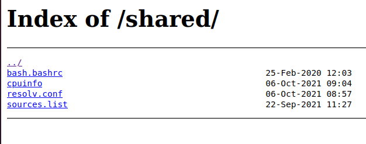

# Configuración de listado de archivos

### Configuración previa.

Creamos la carpeta shared en ```/home/alu<cial>/webapps/shared```.

## Archivos.

Empezamos enlazando los ficheros del sistema mediante enlaces simbólicos en la carpeta **shared**.


Procedemos a editar el fichero alu<cial>.me y añadimos las siguientes líneas.

* location= especifica la carpeta en la que está metido el index o archivos.

* root= especifica la ruta de nuestra carpeta.

* autoindex on genera un index automático y simple.


Recargamos el servicio y comprobamos que no hay nada que impida su funcionamiento.


Comprobamos que funciona nuestro sitio.



Ahora comprobamos que los archivos se pueden descargar.


