# Trabajando con virtual hosts

Para configurar los sitios necesitaremos el servicio de **nginx**.

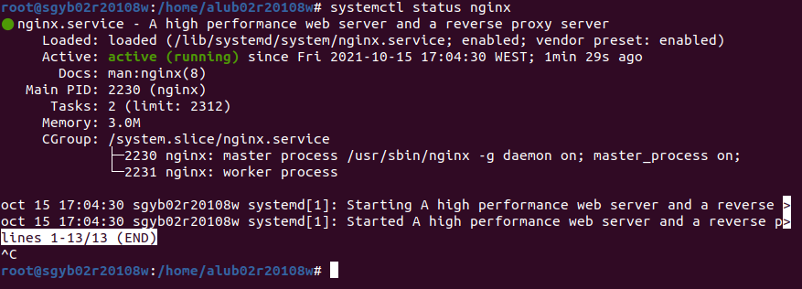

Y deberemos de editar el fichero **/etc/hosts** para añadir los servers asociados a la ip de nuestro equipo.

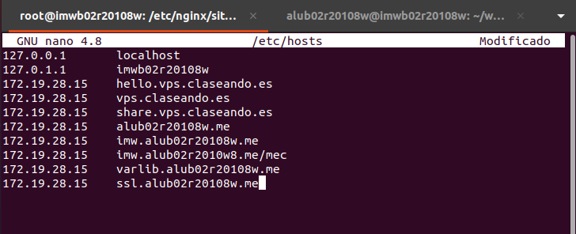

#### Sitio 1: imw.alu"cial".me y imw.alu"cial".me/mec  

Para nuestro primer host debemos de crear un nuevo archivo dentro del directorio **/etc/nginx/sites-available** que se llamará ***imw.alu"cial".me***.


A la hora de abrir el sitio imw.alu"cial".me se nos abre la imagen de las unidades de este curso.

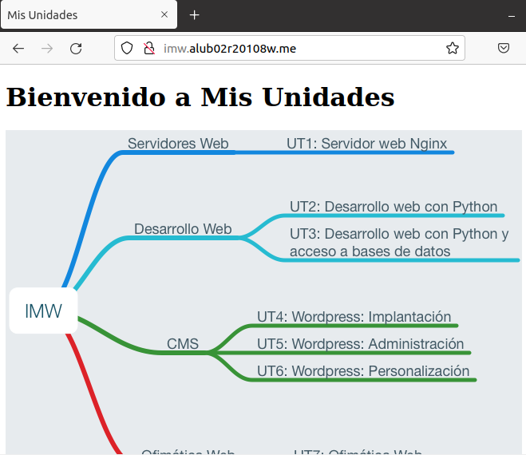

Si abrimos nuestro sitio imw.alu"cial".me/mec se nos abre otra página con un enlace que lleva al Real Decreto de ASIR.

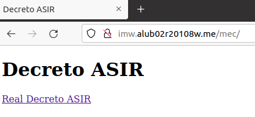

Vemos que nos lleva al Decreto.

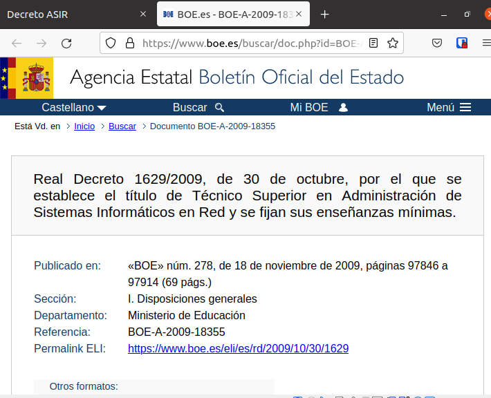

#### Sitio 2: varlib.alu"cial".me

Para nuestro segundo host debemos de crear otro archivo dentro del directorio **/etc/nginx/sites-available** de nombre ***varlib.alu"cial".me***.

El archivo de configuración del segundo sitio debe contener un parámetro que especifique que el puerto de acceso sea el 9000 y que su ruta sea **/var/lib** para que, a la hora de añadir el **autoindex on;** se muestren los archivos de ese directorio.


Listado de archivos del directorio **/var/lib**.

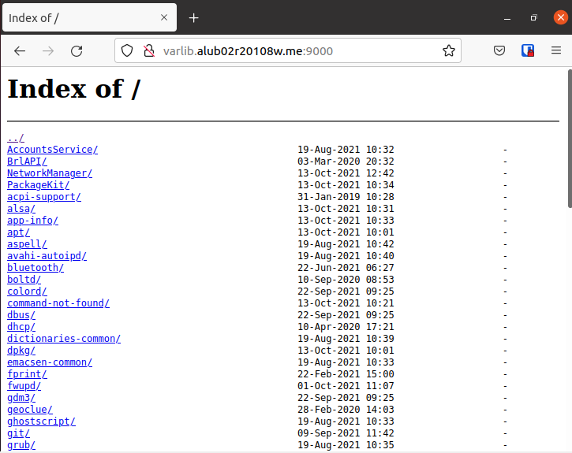

#### Sitio 3: ssl.alu"cial".me/students

Para crear el archivo de configuración .htpasswd debemos de ejecutar el comando perl -le 'print crypt("2asir", 'fewsalt')' que nos da el siguiente texto: ***fePQDifyQ69lo*** para general una contraseña encriptada y luego ejecutaremos el comando echo "usuario1:fePQDifyQ69lo" > .htpasswd.


Editamos el fichero **/etc/nginx/sites-available** para configurar el host.  

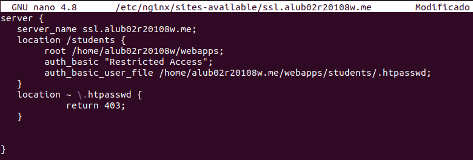

Ahora debemos de linkear nuestro sitio situado en **/etc/nginx/sites-available** a **/etc/nginx/sites-enabled**.
```
 Esto aunque no se haya especificado en los hosts anteriores también se debe hacer.

```

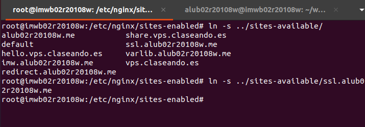

Comprobamos que nos pide el acceso y que tenemos que identificarnos

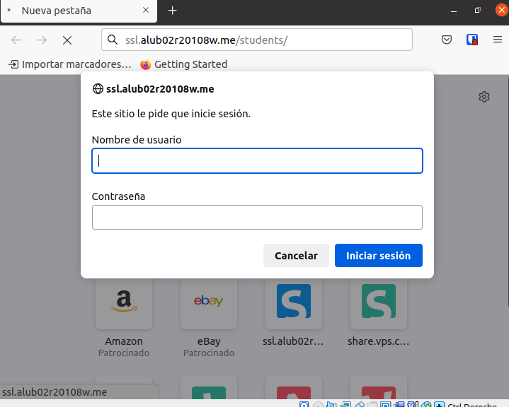

Nos identidicamos y vemos que nos aparece un listado de nuestros compañeros.


#### Sitio 4: redirect.alu"cial".me y target.alu"cial".me

Para montar este host deberemos de crear 2 servidores:
* **target**
* **redirect**

Cuando accedamos al servidor *redirect* nos debe de llevar al servidor target mediante redireccionamiento.

Configuracion del servidor **target**:


Configuracion del servidor **redirect**:


Vemos que hicimos el enlace simbólico desde **sites-available** a **sites-enabled**.


Puede que nos de error al intentar acceder al servidor, se soluciona borrando la caché del navegador. Nos dirigimos al panel de ajustes.

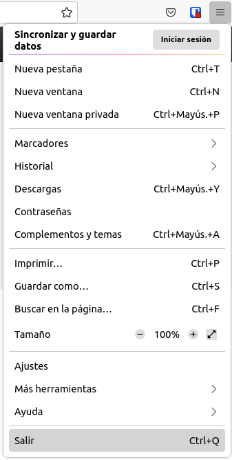

Buscamos **caché** y limpiamos los datos.

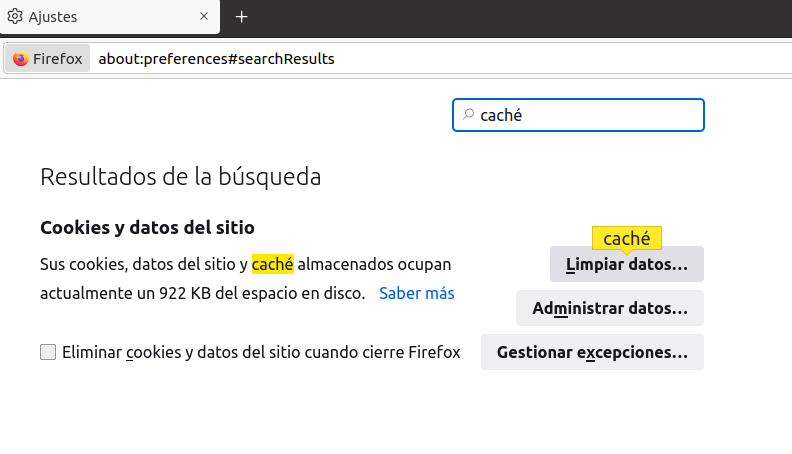
Ahora probamos a entrar a **redirect.alu"cial".me/test** por ejemplo y vemos que nos lleva a **target"cial".me**


