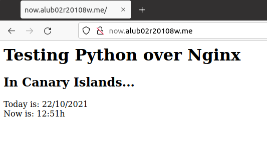

# Aplicaciones en php y python.

Lista de paquetes necesarios para que la practica pueda realizarse:
* Php
* Python3.8
* pip
* uwsgi
* supervisor

#### Preparativos

Debemos de tener una ip fija en la máquina, en mi caso la ip es: **172.19.28.15** y tener configurado en el fichero **/etc/hosts** añadidos los nombres de los servidores que vamos a usar para que las aplicaciones web tengan un sitio en el que mostrarse.

Debemos de tener añadidos los nombres de now."cial".me y php."cial.me"

Debemos de tener descargado y descompreso el archivo **demo_php.zip** que se adjunta con los requisitos de la práctica. Este contienne la carpeta demo_php que he llamado demo para más comodidad. Los permisos de esta carpeta deben ser **755** para todos los archivos y el usuario propietario debe ser el usuario **alu"cial"**

En caso de haber descomprimido la carpeta como usuario root se debe cambiar los permisos con:

Debemos crear y enlazar los ficheros **/etc/nginx/sites-available/php."cial".me** y **/etc/nginx/sites-available/now."cial".me** en la carpeta de **sites-enabled** dentro de **/etc/nginx**.

Para ello podemos ejecutar el comando **ln -s ../sites-available nombre-fichero** desde **/etc/nginx/sites-enable**.

~~~

chmod 755 demo/*

chown alu"cial" demo/*

chgrp alu"cial" demo/*

~~~

## Aplicación Php

Dentro del fichero **/etc/nginx/sites-available/php."cial".me** se encuentra escrita la configuracion del servidor que hace posible la visualización de la aplicacion web de php, el contenido es el siguiente:

Aquí tenemos un vistazo de la aplicación funcionando en el navegador.

## Aplicación Python

Empezamos escribiendo la configuración del servidor que mostrará la aplicación.

Ahora debemos de crear un entorno de desarrollo de aplicaciones dentro de la carpeta **webapps/now**, para ello ejecutamos los comandos sudo pipenv install y sudo pipenv --venv.

Creamos dentro de la carpeta now el fichero main.py que será la aplicación que correrá la página web de now."cial".me.

Dentro del fichero escribimos lo siguiente.

Creamos un fichero **run.sh** para la aplicación y lo rellenamos con la siguientes líneas:

~~~
#!/bin/bash
cd "$(dirname "$0")"
PYTHON_VENV=$(pipenv --venv)
uwsgi --socket :8081 --home $PYTHON_VENV -w main:app
~~~

Cuando ejecutamos la aplicación y escribimos la direccion del servidor en el buscador nos sale la siguiente página.

## Preparativos para supervisor

Para obtener supervisor debemos de ejecutar el comando sudo apt install supervisor.

Debemos de acceder a los ficheros de configuracion en /etc/supervisor/ y añadir/cambiar las siguientes lineas

## Supervisor para aplicaciones Python

Al consultar el estado de la página **now** con supervisorctl status now como usuario con permisos para usar supervisor vemos que no está activa.

Por lo que si fueramos a usar la página no nos llevaría hasta ella.

Ahora encendemos **now**.

Ahora vemos que si es accesible la página.

Paramos el servicio y como antes cuando estaba parado no se puede acceder.

Si reiniciamos el servicio e intentamos acceder de nuevo a la página vemos que sí está operativa

