

# TÍTULO DE LA PRÁCTICA

***Nombre:*** Ayoze Hernández Díaz
***Curso:*** 2º de Ciclo Superior de Administración de Sistemas Informáticos en Red.

### ÍNDICE

+ [Introducción](#id1)
+ [Objetivos](#id2)
+ [Creación y administración de la base de datos](#id3)
+ [Creación de la página de Wordpress](#id4)
+ [Generado de certificado SSL con certbot.](#id5)

#### ***Introducción***. 

Wordpress es una plataforma que permite la creación de sitios web de manera sencilla y guiada al 80% de manera gráfica.

#### ***Objetivos***. 

El objetivo es la creación de un sitio wordpress con certificado SSL.

#### ***Creación y administración de la base de datos***. 

Empezamos creando una base de datos en la máquina de Azure (hecho en clase y no mostrado en el informe por temas de seguridad).

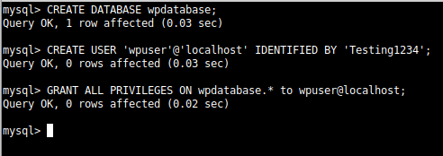

Descargamos y descomprimimos la ultima versión de Wordpress.

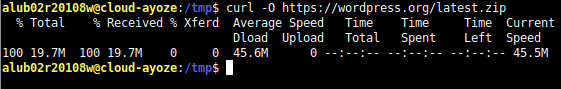

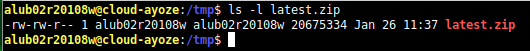

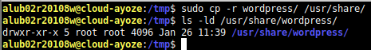

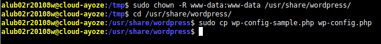

#### ***Creación de la página de Wordpress***. 

Empezamos editando el fichero wp-config.php y cambiamos los campos que definen tanto la base de datos, como la contraseña y usuario que se van a usar.

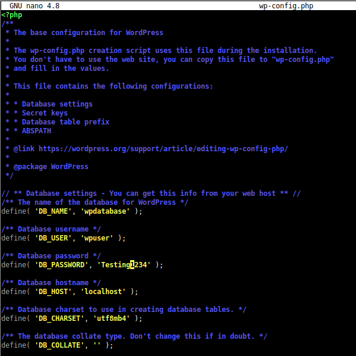

Creamos un fichero de configuración de nginx.

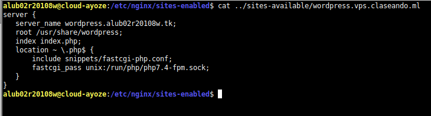

Hacemos un enlace simbólico.

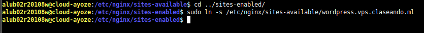

Instalamos un par de paquetes faltantes.

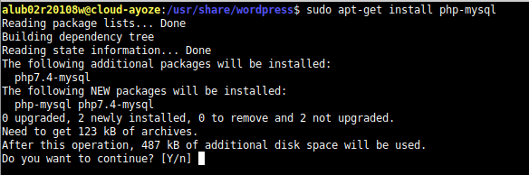

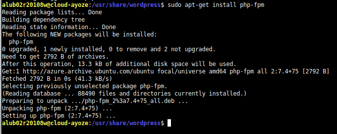

Añadimos la en nuestro dominio la extensión de **wordpress**.

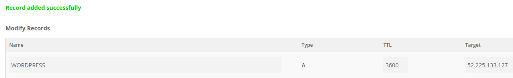

Y vemos que podemos acceder a la instalación de wordpress. Ahora continuamos con valores por defecto y datos de usuario.

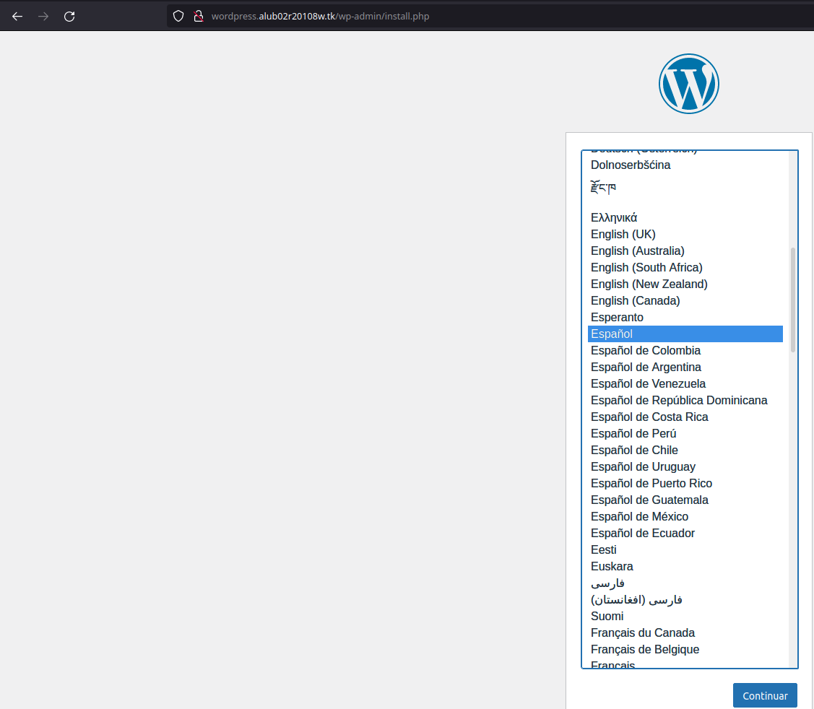

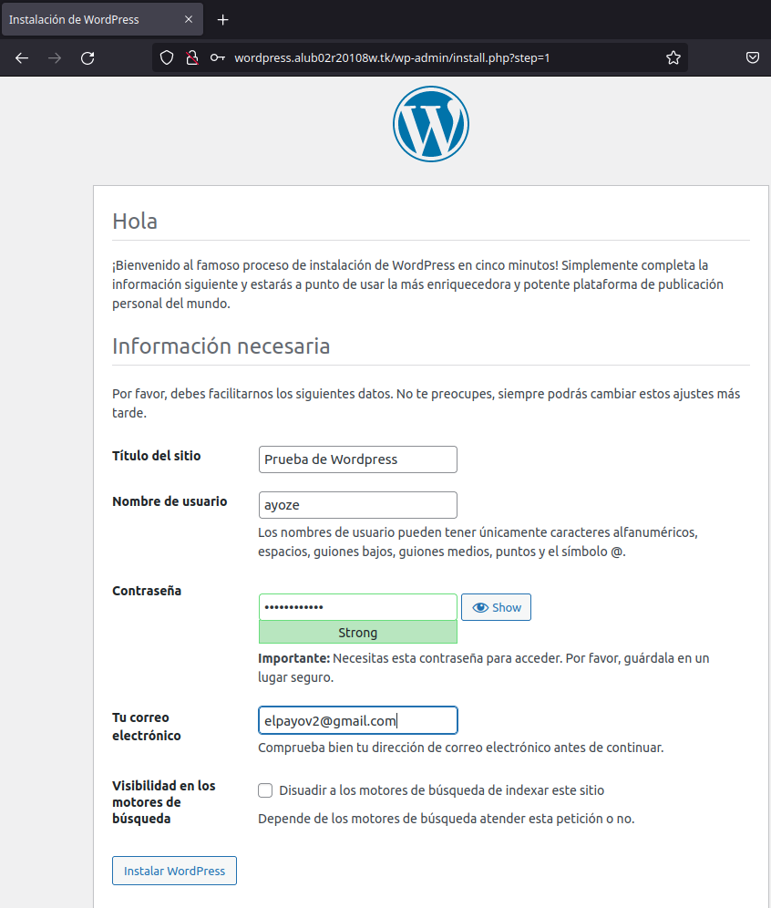

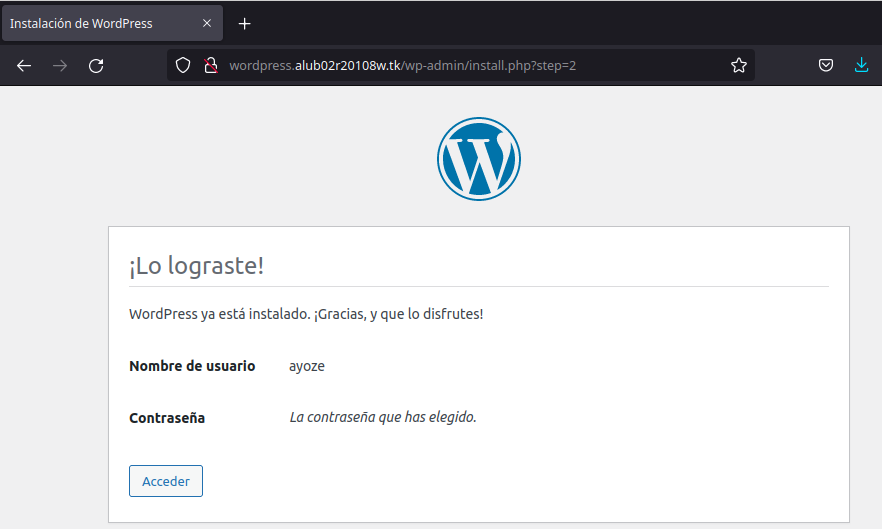

Entramos a nuestro wordpress y añadimos una entrada e instalamos un tema.

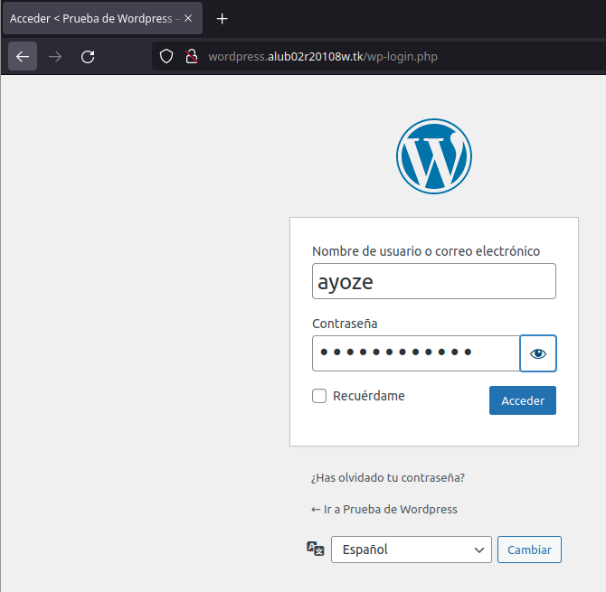

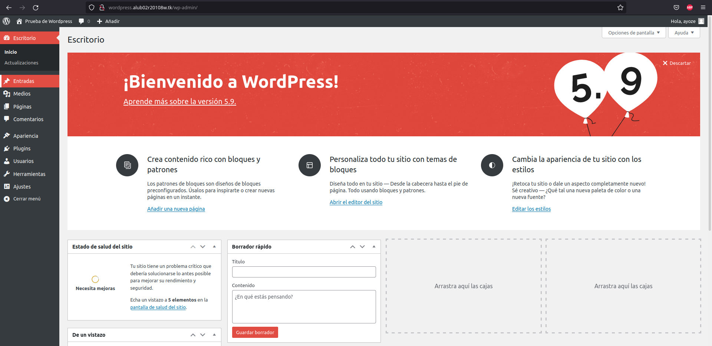

Vamos al apartado apariencia>temas e instalamos uno gratuito.

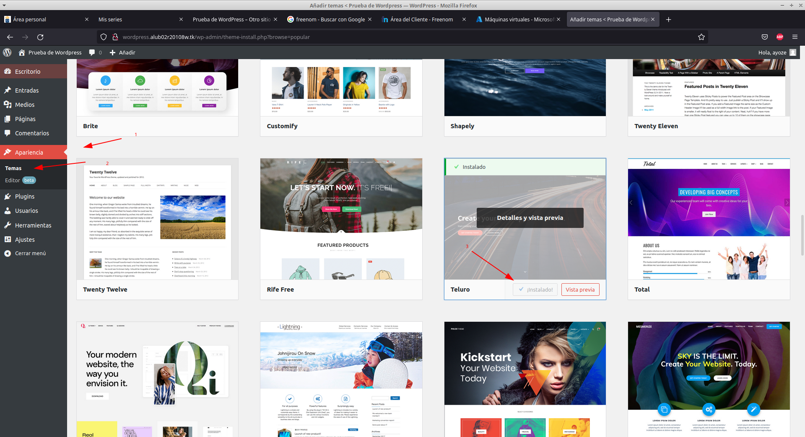

Lo personalizamos un poco.

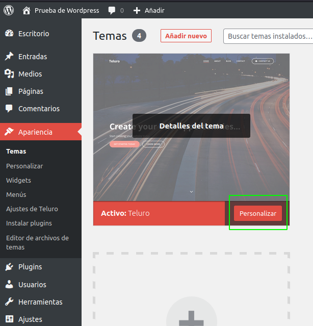

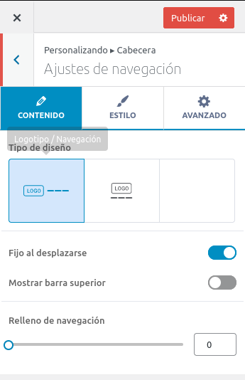

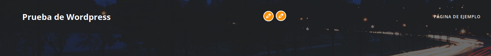

Cambiamos el formato de la url para que aparezca la fecha actual, para ello vamos a **ajustes>enlaces permanentes>ajusts de los enlaces permanentes**.

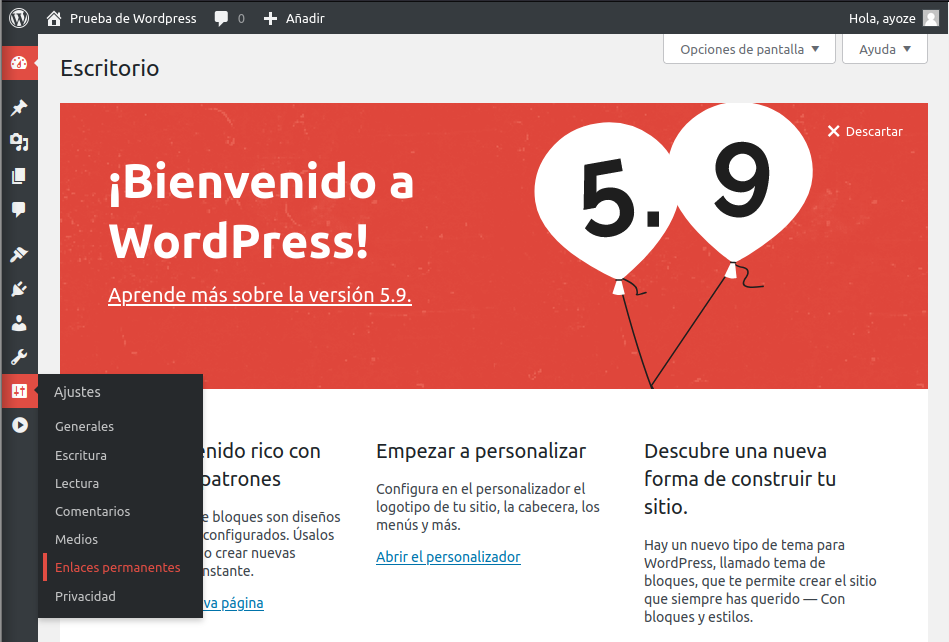

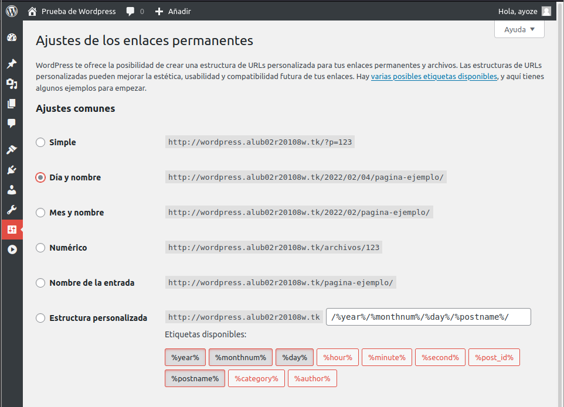

Ahora añadimos una entrada tan fácil como ir a **Entradas>Añadir una nueva entrada** y escribir el contenido deseado.

#### ***Generado de certificado SSL con certbot***. 

Instalamos certbot con sudo **apt install certbot** y ejecutamos los siguientes comandos:

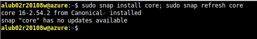

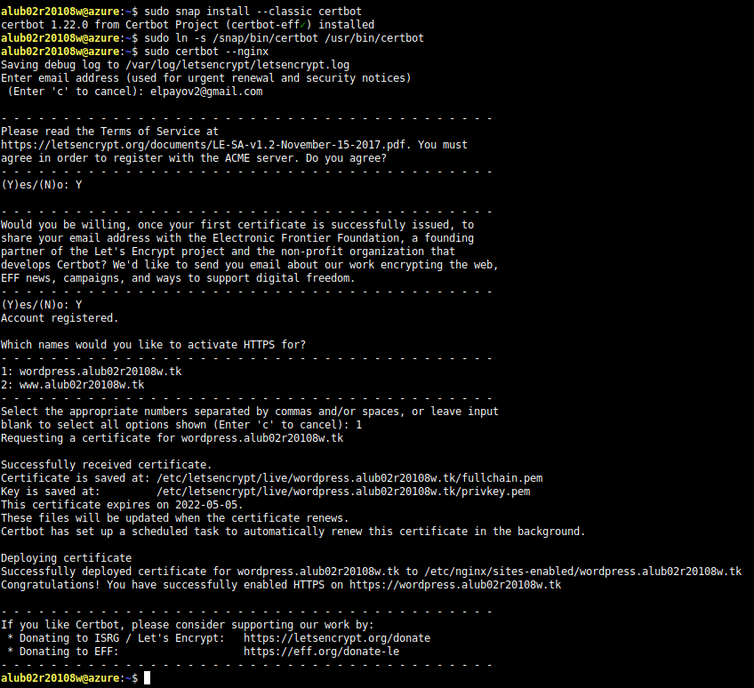

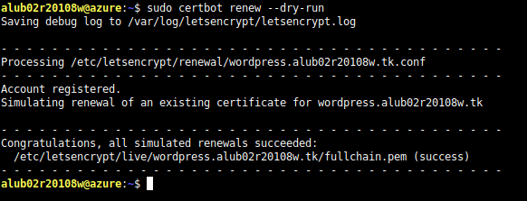

Con esto el sitio ya es accesible por **https**
