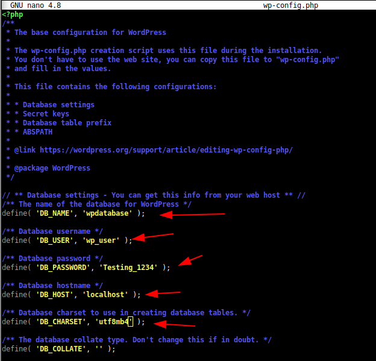
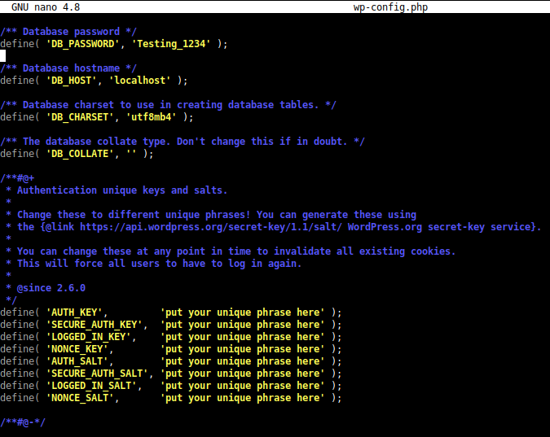

# TÍTULO DE LA PRÁCTICA

***Nombre:*** Ayoze Hernández Díaz
***Curso:*** 2º de Ciclo Superior de Administración de Sistemas Informáticos en Red.

### ÍNDICE

+ [Introducción](#id1)
+ [Objetivos](#id2)
+ [Creación y administración de la base de datos](#id3)
+ [Creación de la página de Wordpress](#id4)
+ [Generado de certificado SSL con certbot.](#id5)

#### ***Introducción***. 

#### ***Objetivos***. 

#### ***Creación y administración de la base de datos***. 

#### ***Creación de la página de Wordpress***. 

#### ***Generado de certificado SSL con certbot***. 

